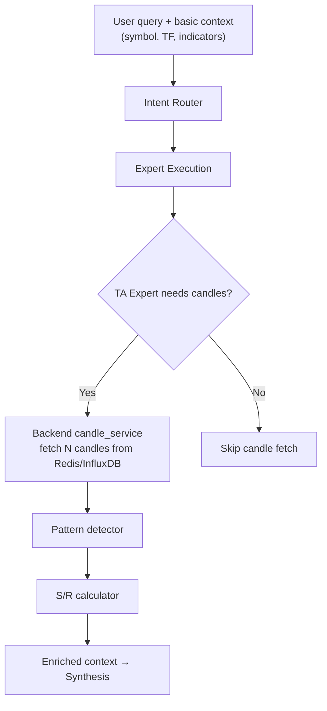
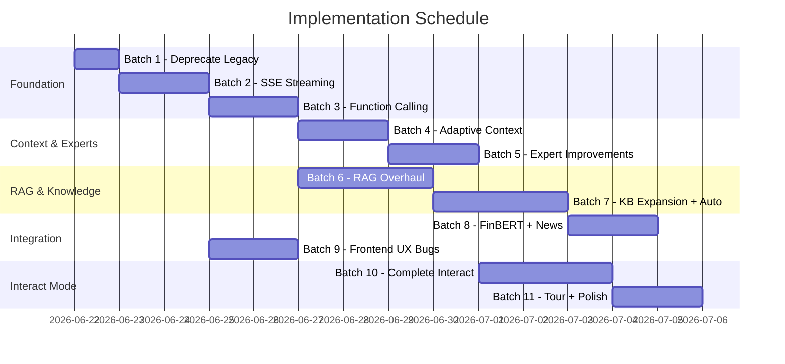

# LMView AI System — Full Implementation Plan

> **Version:** 0.25.60 → target 0.26.x  
> **Infrastructure:** 2-node Docker Swarm — Core: 4 vCPU / 32 GB RAM, Worker: 4 vCPU / 16 GB RAM  
> **API Provider:** DashScope (Alibaba Cloud) — OpenAI-compatible, supports **streaming SSE** and **function calling (tool_calls)**  
> **Primary model chain:** qwen3.7-plus → qwen3.7-max → qwen3.6-max-preview → qwen3.6-plus → qwen3.5-plus → qwen3.6-flash → qwen3.5-flash  
> **Key rotation:** multi-key round-robin via `DASHSCOPE_API_KEYS` env (comma-separated)  
> **Scope:** All features implemented — nothing deferred to future

---

## Hardware Budget (Core Node)

AI services share the core node (32 GB RAM). Current allocations:

| Service | Limit | Notes |
|---|---|---|
| fastapi-prod (embedded AI) | 2 GB | Includes `ai_service` in-process |
| ai-service (standalone) | 4 GB | If separated later |
| litellm proxy | 2 GB | Gateway to DashScope |
| finbert-worker | 4 GB | FinBERT + PyTorch CPU |
| **Available for new models** | ~0 GB | Other services consume ~20 GB |

> [!IMPORTANT]
> **No room for local GPU models or large embedding models.** All heavy computation must be either:
> 1. **API-based** (DashScope handles LLM compute)
> 2. **Lightweight CPU models** (sentence-transformers ≤500 MB RAM, cross-encoder ≤300 MB RAM)
> 3. **Pre-computed offline** (FinBERT worker runs in its own container)
>
> BGE-M3 (1024-dim, ~2.3 GB VRAM) is **too large** for CPU in this deployment. Use **`all-MiniLM-L12-v2`** (384-dim, ~130 MB) or **`paraphrase-multilingual-MiniLM-L12-v2`** (384-dim, ~470 MB, multilingual incl. Vietnamese) instead.

---

## Pre-Batch: Key Verification & Research Findings

### Model/Key Rotation — Verified ✅

The current implementation in [config.py](file:///mnt/efs/LMView/ai_service/config.py#L181-L222) works correctly:
- `DASHSCOPE_API_KEYS` (comma-separated) → round-robin rotation on quota errors
- [litellm_provider.py](file:///mnt/efs/LMView/ai_service/providers/litellm_provider.py#L94-L201) implements key rotation + model fallback chain
- 7-model fallback chain configured in [ai.api.yaml](file:///mnt/efs/LMView/ai_service/configs/ai.api.yaml)
- **No code issue found** — rotation works as designed

### DashScope Capabilities — Verified ✅

| Feature | Supported | Via |
|---|---|---|
| **SSE Streaming** | ✅ Yes | `stream=True` in OpenAI-compat API |
| **Function Calling (tool_calls)** | ✅ Yes | Standard OpenAI `tools` parameter |
| **Streaming + Function Calling** | ✅ Yes | Tool call chunks streamed via SSE |
| **Reasoning models** | ✅ Yes | `reasoning_content` field in delta |

LiteLLM supports `stream=True` passthrough to DashScope — no custom SSE handler needed.

### KB Language Answer

> **Yes — English KB with Vietnamese LLM responses works well.** The LLM (Qwen 3.7) is natively multilingual. RAG chunks in English are injected as context; the system prompt already instructs `"Respond in the same language the user writes in."` With the multilingual embedding model upgrade, Vietnamese queries will also retrieve English KB content via cross-lingual similarity.

---

## Batch 1: Deprecate Legacy Pipeline & Set LangGraph as Default

> **Goal:** Remove the legacy linear pipeline. Make LangGraph DAG the only path. Clean up dead code.

### Files to Modify

| File | Action |
|---|---|
| [orchestrator.py](file:///mnt/efs/LMView/ai_service/core/orchestrator.py) | Remove legacy pipeline branch, keep only LangGraph dispatch |
| [config.py](file:///mnt/efs/LMView/ai_service/config.py) | Change default `orchestration_mode` to `"langgraph"`, remove `"legacy"` from valid modes |
| [docker-compose.swarm.yml](file:///mnt/efs/LMView/docker-compose.swarm.yml#L235) | Change `AI_ORCHESTRATION: ${AI_ORCHESTRATION:-legacy}` → `AI_ORCHESTRATION: ${AI_ORCHESTRATION:-langgraph}` |
| [prompt_builder.py](file:///mnt/efs/LMView/ai_service/prompts/prompt_builder.py) | Keep as utility (synthesis still uses parts of it), but mark legacy `build_ask_prompt` as internal |
| `.env.example` | Update `AI_ORCHESTRATION=langgraph` |

### Changes

1. **In `orchestrator.py`:**
   - Remove the entire legacy pipeline branch (~200 lines including `TOOL_CATALOG_LEGACY`, `_build_tool_catalog_text_legacy()`, and the linear flow inside `run_chat`)
   - `run_chat()` should ONLY dispatch to `ai_service.agents.graph.run_graph()` (the LangGraph DAG)
   - Keep session persistence, error handling, and response assembly code
   - Remove `AI_ORCHESTRATION` conditional — always use LangGraph

2. **In `config.py`:**
   - Set `VALID_ORCHESTRATION_MODES = {"langgraph"}` 
   - Default `orchestration_mode = "langgraph"` in `AISettings`
   - Remove normalization for "legacy"

3. **In Swarm config:**
   - Update env default to `langgraph`

---

## Batch 2: SSE Streaming for AI Responses

> **Goal:** Stream LLM responses token-by-token via SSE. Fix the "waiting too long" bug.

### Files to Modify/Create

| File | Action |
|---|---|
| `ai_service/providers/litellm_provider.py` | Add `generate_chat_completion_stream()` method using `litellm.acompletion(stream=True)` |
| `ai_service/providers/base.py` | Add abstract `generate_chat_completion_stream()` |
| `ai_service/providers/none_provider.py` | Add streaming stub (yields full content as single chunk) |
| `ai_service/providers/router.py` | Add `route_completion_stream()` → yields `AsyncGenerator[str, None]` |
| `ai_service/agents/synthesis.py` | Add `synthesize_response_stream()` variant that yields tokens |
| `ai_service/core/orchestrator.py` | Add `run_chat_stream()` that yields SSE events |
| `backend/api/ai/chat.py` | Add `POST /api/ai/chat/stream` endpoint returning `StreamingResponse` with `text/event-stream` |
| `backend/services/ai/ai_proxy.py` | Add `chat_stream()` for embedded + HTTP streaming |
| `frontend/src/services/aiService.ts` | Add `aiChatStream()` using `fetch` + `ReadableStream` reader |
| `frontend/src/features/ai/hooks/useAiChat.ts` | Update `sendMessage` to use streaming when available, progressive content update |
| `frontend/src/features/ai/components/AiAssistantPanel.tsx` | Show token-by-token content, typing indicator with granular progress states |

### SSE Protocol

```
event: token
data: {"content": "The RSI", "done": false}

event: token
data: {"content": " indicator", "done": false}

event: metadata
data: {"provider": "api", "model": "qwen3.7-plus", "token_input": 1200}

event: done
data: {"content": "full response here", "tool_calls": [...], "confidence": 0.85}
```

### Implementation Details

1. **LiteLLM streaming:** `response = await litellm.acompletion(**kwargs, stream=True)` returns an async generator of `ModelResponse` chunks. Each chunk has `choices[0].delta.content`.

2. **Output guard:** Apply output guard on the full accumulated response AFTER streaming completes, then send a final `done` event with any guard warnings.

3. **Reflection:** Skip reflection loop for streaming (reflection is post-hoc). The `done` event includes the validation result.

4. **Frontend fallback:** If streaming fails mid-way, fall back to showing accumulated content + error message. Handle `EventSource` connection drops gracefully.

5. **Timeout fix:** The current 180s httpx timeout in `ai_proxy.py` causes "generic answer that disappears on reload" when the LLM is slow. With streaming, first token arrives in 1-3s, keeping the connection alive.

### Bug Fixes Included

- ✅ "Waiting too long gives generic answer that disappears on reload" — streaming prevents timeout
- ✅ "No AI-error notifications" — SSE error events sent for failures
- ✅ "No typing indicator / granular progress" — token-by-token rendering

---

## Batch 3: Enable LLM Native Function Calling

> **Goal:** Pass tool definitions to DashScope so the LLM proposes chart actions via native `tool_calls`, replacing regex pattern matching.

### Files to Modify

| File | Action |
|---|---|
| `backend/models/ai/providers.py` | Add `tools` field to `LLMCompletionRequest` |
| `ai_service/providers/litellm_provider.py` | Pass `tools` parameter to `litellm.acompletion()` |
| `ai_service/agents/experts/chart_interaction.py` | Convert `CHART_TOOLS` dict to OpenAI-compatible `tools` format. Keep regex as fallback for non-interact mode |
| `ai_service/agents/synthesis.py` | Build `tools` parameter from `CHART_TOOLS` and pass to LLM request when mode == "interact". Parse `response.choices[0].message.tool_calls` |
| `ai_service/actions/validator.py` | Validate LLM-proposed tool calls against typed schemas |

### OpenAI Tool Format

Convert existing `CHART_TOOLS` dict to:

```python
OPENAI_TOOLS = [
    {
        "type": "function",
        "function": {
            "name": "add_indicator",
            "description": "Add a technical indicator to the chart",
            "parameters": {
                "type": "object",
                "properties": {
                    "indicator": {
                        "type": "string",
                        "enum": ["sma20", "sma50", "ema12", ...],
                        "description": "Indicator identifier"
                    }
                },
                "required": ["indicator"]
            }
        }
    },
    ...
]
```

### Key Design Decisions

1. **Only pass tools in Interact mode** — Ask mode should not propose tool calls
2. **Keep regex pattern matching as backup** — If LLM doesn't return tool_calls, fall back to regex parsing
3. **Validate all LLM-proposed tools** against the typed schema before sending to frontend
4. **tool_choice: "auto"** — Let the LLM decide when to propose tools (don't force every response to have tools)

---

## Batch 4: Adaptive Chart Context & Expert-Driven Candle Retrieval

> **Goal:** Let experts decide how many candles to fetch based on the user's question. Send rich context from both frontend and backend.

### Architecture



### Files to Modify/Create

| File | Action |
|---|---|
| `frontend/src/features/ai/components/AiAssistantPanel.tsx` | Send `candles.slice(-20)` as lightweight preview (not full 100). Send actual indicator values, not just names |
| `frontend/src/features/ai/types.ts` | Extend `ChartContextForAi` with `recent_candles`, `indicator_values` fields |
| `backend/services/candle_service.py` | Add `get_candles_for_ai(symbol, exchange, interval, count)` method that fetches from Redis → InfluxDB |
| `ai_service/agents/experts/technical_analysis.py` | Add candle request logic: determine N based on intent (pattern detection: 50, trend: 20, S/R: 100). Call `candle_service` to fetch. Compute indicators server-side |
| `ai_service/context/pattern_detector.py` | **NEW** — Detect candlestick patterns (hammer, doji, engulfing, etc.) from candle array |
| `ai_service/context/support_resistance.py` | **NEW** — Compute S/R levels using pivot points + recent highs/lows |
| `ai_service/context/multi_timeframe.py` | **NEW** — Fetch higher TF summaries (if user is on 1H, also get 4H/1D trend direction) |
| `ai_service/agents/types.py` | Add `CandleRequest` dataclass to `ExpertOutput` structured_data |

### Candle Count Decision Matrix

| Intent / Query Type | Candles Needed | Fetched By |
|---|---|---|
| Simple indicator question | 0 (use Redis snapshot) | TA Expert |
| "What's the trend?" | 20-30 | TA Expert |
| "Any candlestick patterns?" | 5-10 | TA Expert |
| "Support and resistance?" | 50-100 | TA Expert |
| "Full chart analysis" | 100 | TA Expert |
| "Draw a trendline" (Interact) | 50-100 | Chart Interaction Expert |
| General knowledge question | 0 | Skip |

### Frontend Context Enhancement

```typescript
// AiAssistantPanel.tsx — enriched context
chartContext = {
  symbol: selectedSymbol,
  exchange,
  timeframe,
  chart_type: "candles",
  selected_indicators: selectedIndicators,
  // NEW: send last 20 candles as lightweight preview
  recent_candles: candles.slice(-20).map(c => ({
    time: c.time, open: c.open, high: c.high,
    low: c.low, close: c.close, volume: c.volume,
  })),
  // NEW: send actual indicator values from chart state
  indicator_values: getActiveIndicatorValues(), // extract from chart series
  frontend_context_version: "3.0.0",
};
```

---

## Batch 5: Expert System Improvements

> **Goal:** Improve expert quality with a supervisor agent, intent router LLM fallback, and enhanced reflection.

### Files to Modify/Create

| File | Action |
|---|---|
| `ai_service/agents/experts/supervisor.py` | **NEW** — Lightweight supervisor that resolves conflicts between expert signals (e.g., TA bullish vs news bearish). Runs as post-expert pre-synthesis node. Does NOT call LLM — uses weighted signal aggregation |
| `ai_service/agents/intent_router.py` | Implement `_llm_classify_intent()` — a structured-output LLM call (using flash model) for queries with confidence < 0.45 |
| `ai_service/agents/reflection.py` | Enhance with semantic checks: verify that the response references expert data that was available; check for unsupported claims; add per-expert utilization scoring |
| `ai_service/agents/graph.py` | Insert `supervisor_node` between `expert_execution` and `synthesis`. Register new node |
| `ai_service/agents/types.py` | Add `SupervisorResult` dataclass |
| `ai_service/agents/experts/technical_analysis.py` | Enrich output with signal strength (not just bias direction) for supervisor to weight |
| `ai_service/agents/experts/market_data.py` | Add order book imbalance interpretation, volume anomaly detection |
| `ai_service/agents/experts/news_sentiment.py` | Integrate FinBERT results from `news_sentiment_cache` table instead of raw DB sentiment |

### Supervisor Logic (No Extra LLM Call)

```python
async def supervisor_node(state: AgentState) -> AgentState:
    """Resolve conflicting expert signals."""
    expert_outputs = state.get("expert_outputs", {})
    
    # Collect directional signals with weights
    signals = []
    for name, output in expert_outputs.items():
        if output.structured_data.get("trend_summary"):
            signals.append({
                "expert": name,
                "direction": output.structured_data["trend_summary"],
                "confidence": output.confidence,
                "weight": EXPERT_WEIGHTS.get(name, 1.0),
            })
    
    # Detect conflicts
    directions = set(s["direction"] for s in signals if s["direction"] != "neutral")
    if len(directions) > 1:
        # Weighted vote
        consensus = _weighted_consensus(signals)
        conflict_note = f"Experts disagree: {signals}. Weighted consensus: {consensus}."
    else:
        consensus = directions.pop() if directions else "neutral"
        conflict_note = None
    
    return {
        "supervisor_result": SupervisorResult(consensus=consensus, conflict_note=conflict_note),
        "warnings": state.get("warnings", []) + ([conflict_note] if conflict_note else []),
    }
```

### Updated DAG

```
scope_gate → intent_router → expert_execution (parallel) → supervisor → synthesis → reflection ↺
```

### Intent Router LLM Fallback

```python
async def _llm_classify_intent(query, mode, chart_context):
    """Use a fast model to classify ambiguous queries."""
    from ai_service.providers.router import get_provider_router
    # Use flash model for speed/cost
    request = LLMCompletionRequest(
        messages=[
            LLMMessage(role="system", content=INTENT_CLASSIFICATION_PROMPT),
            LLMMessage(role="user", content=query),
        ],
        temperature=0, max_tokens=100, top_p=0.1,
    )
    # Force flash model for classification
    response, _ = await get_provider_router().route_completion(request)
    return _parse_intent_response(response.content)
```

---

## Batch 6: RAG Overhaul — Embedding Upgrade + Hybrid Search

> **Goal:** Upgrade embedding model (hardware-safe), add BM25 hybrid search, add cross-encoder reranking.

### Hardware-Aware Model Selection

| Option | Size (RAM) | Dimensions | Multilingual | Decision |
|---|---|---|---|---|
| `BGE-M3` | ~2.3 GB | 1024 | ✅ | ❌ Too large for CPU deployment |
| `paraphrase-multilingual-MiniLM-L12-v2` | ~470 MB | 384 | ✅ (50+ languages incl. Vietnamese) | ✅ **Best fit** |
| `all-MiniLM-L12-v2` | ~130 MB | 384 | English only | Backup option |
| `cross-encoder/ms-marco-MiniLM-L-6-v2` | ~90 MB | N/A (reranker) | English | ✅ For reranking |

**Selected:** `paraphrase-multilingual-MiniLM-L12-v2` (470 MB) + `cross-encoder/ms-marco-MiniLM-L-6-v2` (90 MB) = ~560 MB total → fits within fastapi-prod's 2 GB limit alongside other services.

### Files to Modify/Create

| File | Action |
|---|---|
| `ai_service/configs/ai.api.yaml` | Change `embedding_model` to `paraphrase-multilingual-MiniLM-L12-v2` |
| `ai_service/rag/knowledge_service.py` | Update embedding generation to use new model. Add migration function to re-embed all existing chunks |
| `ai_service/rag/retrieval_service.py` | Add BM25 keyword search alongside vector search. Implement RRF (Reciprocal Rank Fusion) to merge results |
| `ai_service/rag/reranker.py` | **NEW** — Cross-encoder reranking using `ms-marco-MiniLM-L-6-v2` |
| `ai_service/rag/bm25_search.py` | **NEW** — PostgreSQL `ts_vector` + `ts_query` based BM25 keyword search |
| `backend/migrations/0XX_rag_bm25_tsvector.sql` | Add `tsvector` column + GIN index to `ai_knowledge_chunks` table |
| `ai_service/config.py` | Add `reranker_model`, `hybrid_search_weight` settings |

### Hybrid Search Flow

```
Query → [Vector Search (top-20)] + [BM25 Search (top-20)]
                    ↓                         ↓
              RRF Merge (deduplicate, rank fusion)
                    ↓
             Top-10 candidates
                    ↓
         Cross-Encoder Rerank (top-6)
                    ↓
         Final 6 chunks → LLM context
```

### Migration Strategy

1. Add new `tsvector` column to chunks table (migration SQL)
2. Re-embed ALL existing chunks with new multilingual model (one-time script)
3. Verify retrieval quality with test queries in both English and Vietnamese
4. Keep old embeddings temporarily for rollback

---

## Batch 7: Knowledge Base Expansion + Auto-Ingestion Trigger

> **Goal:** Write all missing KB documents, add them to pgvector, and implement automatic ingestion trigger.

### New KB Documents to Write

| Document | Size Est. | Content |
|---|---|---|
| `Chart_Pattern_Encyclopedia.md` | ~25 KB | H&S, double top/bottom, triangles, wedges, flags, pennants, cup & handle. Each with: description, identification rules, volume confirmation, trading implications, failure patterns |
| `Multi_Timeframe_Analysis.md` | ~15 KB | Top-down analysis approach, higher TF trend + lower TF entry, timeframe alignment signals, confluency scoring |
| `On_Chain_Analytics.md` | ~15 KB | Exchange flows, whale alerts, NVT ratio, MVRV, SOPR, network metrics, address activity |
| `DeFi_Analysis.md` | ~12 KB | TVL trends, yield farming risks, impermanent loss math, protocol metrics (Uniswap, Aave), DEX vs CEX volume |
| `Market_Regime_Detection.md` | ~10 KB | Trending vs ranging, volatility regimes (ATR-based), ADX usage, chop index, mean reversion vs momentum |
| `Correlation_Analysis.md` | ~10 KB | BTC dominance cycle, alt season indicators, cross-asset correlations, stablecoin flows, macro correlations |
| `Order_Flow_Analysis.md` | ~12 KB | CVD (cumulative volume delta), footprint charts, absorption/exhaustion patterns, delta divergence |
| `Risk_Management_Frameworks.md` | ~15 KB | Kelly criterion, fixed fractional, position sizing, portfolio allocation models, max drawdown management, risk-reward optimization |

### Auto-Ingestion System

| File | Action |
|---|---|
| `ai_service/rag/auto_ingest.py` | **NEW** — Watch `docs/ai/knowledge_base/approved/` for file changes. On new/modified .md file: validate via registry → chunk → embed → upsert to pgvector |
| `ai_service/rag/knowledge_service.py` | Add `ingest_all_approved()` method that scans and ingests all approved KB files. Add `ingest_file(path)` for single-file ingestion |
| `backend/app.py` | Add startup task: run `ingest_all_approved()` on FastAPI lifespan startup if `AI_ENABLE_RAG=true` |
| `ai_service/rag/registry.py` | Add `get_uningested_files()` method to find KB files not yet in pgvector |
| `backend/api/ai/admin.py` | Add `POST /api/ai/admin/kb/ingest` endpoint for manual trigger. Add `GET /api/ai/admin/kb/status` to show ingestion status |

### Auto-Ingest Trigger Logic

```python
async def ingest_all_approved():
    """Scan approved KB, ingest any new/modified files."""
    root = knowledge_base_root() / "approved"
    for md_file in root.glob("*.md"):
        if not allowed_for_ingestion(md_file):
            continue
        # Check if file hash changed since last ingestion
        file_hash = hashlib.sha256(md_file.read_bytes()).hexdigest()
        if await _already_ingested(file_hash):
            continue
        # Chunk, embed, upsert
        chunks = chunk_document(md_file)
        embeddings = embed_chunks(chunks)
        await upsert_chunks(chunks, embeddings, file_hash)
        logger.info("Ingested %s (%d chunks)", md_file.name, len(chunks))
```

### Registry Updates

Add all 8 new documents to `docs/ai/knowledge_base/registry.yml` with:
- `review_status: approved`
- `allowed_for_rag: true`
- `credibility_level: reviewed`
- `domain: crypto_education` / `technical_analysis` / `risk_management`

---

## Batch 8: FinBERT Full Integration + News Feed Ingestion

> **Goal:** Complete FinBERT integration. Wire FinBERT results into AI context. Add RSS news feed ingestion.

### Current State

- [finbert.py](file:///mnt/efs/LMView/ai_service/nlp/finbert.py) — ✅ Fully implemented, GPU/CPU fallback
- [news_processor.py](file:///mnt/efs/LMView/ai_service/nlp/news_processor.py) — ✅ Background worker, reads from `news_articles`, writes to `news_sentiment_cache`
- [finbert-worker](file:///mnt/efs/LMView/docker-compose.swarm.yml#L400-L437) — ✅ Docker container defined (4 GB limit, CPU mode)
- **Gap:** No news feed ingestion (no RSS/API source for `news_articles` table)
- **Gap:** `news_context.py` doesn't read from `news_sentiment_cache` (still uses raw `sentiment_score` from `news_articles`)

### Files to Modify/Create

| File | Action |
|---|---|
| `ai_service/nlp/news_feed.py` | **NEW** — RSS feed ingester. Fetches from CoinDesk, CoinTelegraph, Decrypt RSS feeds. Stores in `news_articles` table |
| `ai_service/nlp/news_processor.py` | Add health heartbeat (write `/tmp/finbert_healthy` periodically). Add news feed ingestion call before FinBERT processing |
| `ai_service/context/news_context.py` | Update `_fetch_relevant_articles()` to JOIN with `news_sentiment_cache` and use FinBERT scores when available |
| `backend/migrations/0XX_news_rss_source.sql` | Add `source_url`, `feed_type` columns to `news_articles` if not present |
| `ai_service/nlp/entity_extractor.py` | Complete the scaffolded entity extraction (crypto ticker detection, event classification) |

### RSS Feed Sources

```python
NEWS_FEEDS = [
    {"name": "CoinDesk", "url": "https://www.coindesk.com/arc/outboundfeeds/rss/", "reliability": 0.9},
    {"name": "CoinTelegraph", "url": "https://cointelegraph.com/rss", "reliability": 0.85},
    {"name": "Decrypt", "url": "https://decrypt.co/feed", "reliability": 0.8},
    {"name": "The Block", "url": "https://www.theblock.co/rss.xml", "reliability": 0.85},
    {"name": "Bitcoin Magazine", "url": "https://bitcoinmagazine.com/feed", "reliability": 0.8},
]
```

### Integration Flow

```
RSS Feeds → news_feed.py (every 15 min) → news_articles table
                                               ↓
                               news_processor.py (every 5 min)
                                               ↓
                              FinBERT analysis → news_sentiment_cache
                                               ↓
                          news_context.py reads both tables
                                               ↓
                              Expert/Synthesis gets enriched news context
```

### FinBERT Worker Activation

The `finbert-worker` service is already defined in `docker-compose.swarm.yml` but may need profile activation. Ensure it's included in the `prod` profile:

```yaml
finbert-worker:
  profiles: ["prod"]
```

---

## Batch 9: Frontend UX Bug Fixes & Chat Improvements

> **Goal:** Fix all discovered bugs. Add response rating, suggested follow-ups, improved suggested prompts.

### Bug Fixes

| Bug | Fix Location | Solution |
|---|---|---|
| "Generic answer disappears on reload" | `useAiChat.ts` | Already fixed by Batch 2 (streaming). Additionally: persist error responses to session storage so they survive reload |
| "No AI-error notifications" | `AiAssistantPanel.tsx` | Add toast notification on error using existing notification system. Show inline error card with retry button |
| "Cluttering badges confuse users" | `AiAssistantPanel.tsx:194-223` | Move model badge to admin-only debug panel. Keep only confidence + news status chips for normal users. Simplify chip text |
| "Questions queued and answered in one response" | `useAiChat.ts` | Add request deduplication: disable send button during loading (already done), but also debounce rapid submissions. Queue messages properly |
| "Suggested prompts: more examples, random 3, goes away after session start" | `AiAssistantPanel.tsx` | Create pool of 15+ prompts, pick random 3 on mount. Collapse suggestions section after first user message (currently `setSuggestionsOpen(false)` on message send, but panel re-expands — fix state persistence) |
| "Demo tour broken elements" | `AiActionProvider.tsx` | Audit all `data-ai-section` selectors. Fix positioning for moved/renamed DOM elements. Add null-checks for missing targets |
| "Highlight border too obvious" | `AiActionProvider.tsx` CSS | Change `border: 2px solid` → `box-shadow: 0 0 0 2px rgba(59, 130, 246, 0.3)` with `border: none` |

### New Features

| Feature | File | Implementation |
|---|---|---|
| **Response rating (👍/👎)** | `AiAssistantPanel.tsx`, `backend/api/ai/chat.py` | Add thumbs up/down buttons after each assistant message. Store rating in `ai_chat_messages.metadata.user_rating`. Backend: `PATCH /api/ai/messages/{id}/rate` |
| **Suggested follow-ups** | `AiAssistantPanel.tsx` | Render `suggested_actions` from API response as clickable chips below the assistant message |
| **Message retry** | `useAiChat.ts`, `AiAssistantPanel.tsx` | Add "Retry" button on failed messages. Re-send the same user message |
| **Expanded suggested prompts** | `AiAssistantPanel.tsx` | Pool of 15+ context-aware suggestions. Random 3 shown. Include symbol-specific examples: "Analyze {symbol} trend", "What do indicators say about {symbol}?", "Key support levels for {symbol}?" |

### Files to Modify

| File | Action |
|---|---|
| `frontend/src/features/ai/components/AiAssistantPanel.tsx` | Bug fixes + new features above |
| `frontend/src/features/ai/hooks/useAiChat.ts` | Message retry, debouncing, error persistence |
| `frontend/src/features/ai/actions/AiActionProvider.tsx` | Tour fix, highlight border fix |
| `frontend/src/services/aiService.ts` | Add `rateMessage()` API call |
| `backend/api/ai/chat.py` | Add `PATCH /api/ai/messages/{id}/rate` endpoint |

---

## Batch 10: Complete Interact Mode — Function Calling + Visual Actions

> **Goal:** Make Interact mode fully functional with LLM-driven tool proposals, smart coordinates, and visual feedback.

### Prerequisites (from earlier batches)

- ✅ Batch 3: LLM native function calling enabled
- ✅ Batch 4: Candle data available to experts
- ✅ Batch 5: Supervisor + enhanced experts

### Files to Modify/Create

| File | Action |
|---|---|
| `ai_service/agents/experts/chart_interaction.py` | Rewrite: instead of regex-only proposals, prepare context for LLM to generate tool_calls. Compute smart coordinates from candle data (S/R levels, pattern boundaries) and include them in the tool call context |
| `ai_service/context/support_resistance.py` | Use this (from Batch 4) to compute actual price levels for `draw_trendline`, `highlight_region` coordinates |
| `ai_service/context/pattern_detector.py` | Use this (from Batch 4) to detect patterns and propose `highlight_candles` with exact timestamps |
| `frontend/src/features/ai/actions/AiActionProvider.tsx` | **Refactor:** Split 49KB file into modular action handlers: `indicatorActions.ts`, `chartActions.ts`, `tourActions.ts`, `highlightActions.ts`. Improve action feedback UI (structured result cards instead of text banner) |
| `frontend/src/features/ai/components/ActionFeedbackCard.tsx` | **NEW** — Structured card showing what action was executed, with undo button |
| `frontend/src/features/ai/components/StepOverlay.tsx` | **NEW** — Overlay component for step-by-step analysis guidance |
| `ai_service/agents/synthesis.py` | For interact mode: include computed coordinates from chart_interaction expert in tool_call params. Ensure S/R levels, pattern timestamps are passed through |

### Function Calling Blueprint Improvement

Current `CHART_TOOLS` has redundant/ambiguous tool names. Consolidate and improve:

| Current (Ambiguous) | New (Clear) | Change |
|---|---|---|
| `draw_trendline` + `draw_tool` | `draw_tool` only | Remove `draw_trendline` — use `draw_tool` with `tool: "trendline"` |
| `create_annotation` | `draw_tool` with `tool: "text"` | Merge into `draw_tool` |
| `highlight_region` + `highlight_candles` + `highlight_chart_area` | `highlight` | Single tool with `type: "candles" | "region" | "area"` |
| `add_indicator` + `remove_indicator` + `toggle_indicator` | `manage_indicator` | Single tool with `action: "add" | "remove" | "toggle"` |

### AiActionProvider Refactor Structure

```
frontend/src/features/ai/actions/
  ├── AiActionProvider.tsx       (slim: context + dispatch)
  ├── handlers/
  │   ├── indicatorHandler.ts
  │   ├── chartTypeHandler.ts
  │   ├── timeframeHandler.ts
  │   ├── drawToolHandler.ts
  │   ├── highlightHandler.ts
  │   ├── tourHandler.ts
  │   └── index.ts               (registry)
  └── components/
      ├── ActionFeedbackCard.tsx
      └── StepOverlay.tsx
```

---

## Batch 11: Guided Tour Rewrite + Session Recording + Final Polish

> **Goal:** Rewrite guided tour based on Interact mode template modules. Add analysis session recording. Final polish and CHANGELOG.

### Guided Tour Rewrite

The tour should be a **template-driven** system where each tour step maps to an Interact mode action:

| File | Action |
|---|---|
| `ai_service/tours/tour_templates.py` | **NEW** — Define tour templates as sequences of Interact mode actions with explanations |
| `ai_service/tours/tour_registry.py` | **NEW** — Registry of available tours: "workspace-overview", "indicator-tutorial", "pattern-recognition", "order-flow" |
| `frontend/src/features/ai/actions/handlers/tourHandler.ts` | Rewrite tour execution: read template → execute each step as an Interact mode action → show explanation overlay → wait for user acknowledgment → next step |
| `frontend/src/features/ai/components/TourOverlay.tsx` | **NEW** — Polished tour overlay with step counter, explanation text, "Next" / "Skip" / "Done" buttons |

### Tour Template Format

```python
WORKSPACE_OVERVIEW_TOUR = TourTemplate(
    tour_id="lmview-overview",
    title="LMView Workspace Tour",
    steps=[
        TourStep(
            action={"name": "highlight_section", "arguments": {"target": "chart-panel", "message": "This is the main chart area..."}},
            explanation="The chart displays real-time candlestick data...",
            requires_approval=False,
        ),
        TourStep(
            action={"name": "manage_indicator", "arguments": {"action": "add", "indicator": "rsi"}},
            explanation="RSI (Relative Strength Index) measures momentum...",
            requires_approval=True,
        ),
        # ... more steps
    ],
)
```

### Analysis Session Recording

| File | Action |
|---|---|
| `frontend/src/features/ai/hooks/useAnalysisRecorder.ts` | **NEW** — Record all executed actions during an Interact mode session. Store as ordered list of `{action, timestamp, result}` |
| `frontend/src/features/ai/components/AnalysisRecap.tsx` | **NEW** — End-of-session recap showing: summary of analysis, list of actions taken, key findings |
| `backend/api/ai/sessions.py` | Add `POST /api/ai/sessions/{id}/actions` to persist action log |

### Final Polish

| Item | File | Change |
|---|---|---|
| Update CHANGELOG | `docs/CHANGELOG.md` | Add all batch entries |
| Update SYSTEM.md | `docs/SYSTEM.md` | Update AI section with new architecture |
| Update AGENTS.md | `AGENTS.md` | Update AI Feature Guidance section |
| Update VERSION | `VERSION` | Bump to 0.26.0 |
| RAGAS eval scaffold | `ai_service/eval/ragas_eval.py` | **NEW** — Evaluation pipeline using RAGAS metrics. Initial test suite with 20 gold-standard Q&A pairs for retrieval quality measurement |

---

## Execution Order & Dependencies



> [!NOTE]
> **Parallelizable:** Batches 6-7 (RAG) can run in parallel with Batches 4-5 (Context/Experts). Batch 9 (Frontend bugs) can start after Batch 2 (Streaming). This reduces the critical path from ~22 days to ~14 days.

---

## Rollback Strategy

Each batch should be deployed independently. If a batch causes instability:

1. **Revert the batch's commits** — `git revert <batch-commits>`
2. **Redeploy** — `docker stack deploy -c docker-compose.yml -c docker-compose.swarm.yml lmview --resolve-image never`
3. **For RAG changes (Batch 6):** Keep old embedding column temporarily. Migration adds new column alongside old one
4. **For schema changes:** All migrations are additive (ADD COLUMN, not DROP)

---

## Success Criteria

| Metric | Before | After |
|---|---|---|
| Time to first token | 10-90 seconds | < 3 seconds (streaming) |
| Chart context richness | 1 candle, no indicators | 20-100 candles + indicator values + patterns |
| RAG retrieval (bilingual) | English-only, vector-only | EN+VN queries, hybrid search + reranking |
| KB coverage | 17 docs / 233 KB | 25 docs / ~370 KB |
| Interact mode actions | Regex-only, 5 basic patterns | LLM function calling, 13+ typed tools |
| Expert conflicts | Unresolved | Supervisor-mediated consensus |
| News sentiment | Pre-stored DB scores | FinBERT real-time + RSS feeds |
| User feedback loop | None | 👍/👎 rating + suggested follow-ups |
| Frontend bugs | 7+ known issues | All resolved |
