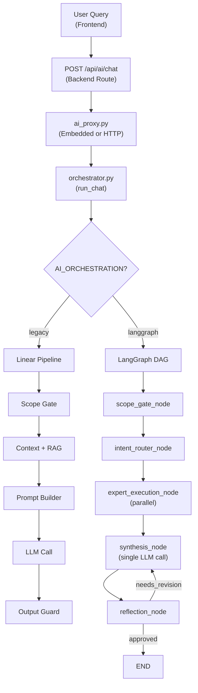
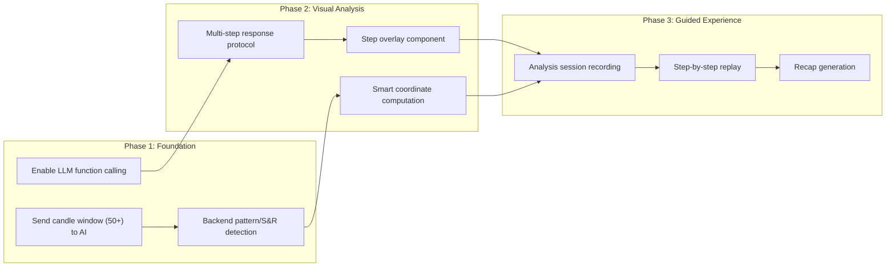

# LMView AI Implementation — Comprehensive Analysis

> Analysis date: 2026-06-21 | Codebase version: 0.25.60 | Branch: deploy/aws-swarm-2node-stable

---

## Table of Contents

1. [AI Features Overview](#1-ai-features-overview)
2. [Academic & Industry Alignment](#2-academic--industry-alignment)
3. [Service Independence](#3-service-independence)
4. [Multi-Agent Architecture Evaluation](#4-multi-agent-architecture-evaluation)
5. [Context Building: Chart & News](#5-context-building-chart--news)
6. [Interact Mode Status & Roadmap](#6-interact-mode-status--roadmap)
7. [Knowledge Base & RAG Assessment](#7-knowledge-base--rag-assessment)
8. [Frontend UI/UX Issues](#8-frontend-uiux-issues)

---

## 1. AI Features Overview

### What's Implemented

| Feature | Status | Key Files |
|---|---|---|
| **Ask Mode** (Q&A chat) | ✅ Functional | [orchestrator.py](file:///mnt/efs/LMView/ai_service/core/orchestrator.py), [prompt_builder.py](file:///mnt/efs/LMView/ai_service/prompts/prompt_builder.py) |
| **Interact Mode** (chart actions) | 🔶 Scaffolded | [chart_interaction.py](file:///mnt/efs/LMView/ai_service/agents/experts/chart_interaction.py), [synthesis.py](file:///mnt/efs/LMView/ai_service/agents/synthesis.py) |
| **Scope Gate** | ✅ Functional (keyword-based) | [scope_gate.py](file:///mnt/efs/LMView/ai_service/safety/scope_gate.py) |
| **Output Guard** | ✅ Functional | [output_guard.py](file:///mnt/efs/LMView/ai_service/safety/output_guard.py) |
| **RAG Knowledge Base** | ✅ Functional | [knowledge_service.py](file:///mnt/efs/LMView/ai_service/rag/knowledge_service.py), [retrieval_service.py](file:///mnt/efs/LMView/ai_service/rag/retrieval_service.py) |
| **News Context** | ✅ Functional | [news_context.py](file:///mnt/efs/LMView/ai_service/context/news_context.py) |
| **LangGraph Multi-Agent DAG** | ✅ Wired (parallel experts) | [graph.py](file:///mnt/efs/LMView/ai_service/agents/graph.py) |
| **Intent Router** | ✅ Functional (rule-based) | [intent_router.py](file:///mnt/efs/LMView/ai_service/agents/intent_router.py) |
| **Expert System** (6 experts) | ✅ Functional | [experts/](file:///mnt/efs/LMView/ai_service/agents/experts/) |
| **Reflection/Revision Loop** | ✅ Functional | [reflection.py](file:///mnt/efs/LMView/ai_service/agents/reflection.py) |
| **Provider Router** (LiteLLM) | ✅ Functional | [router.py](file:///mnt/efs/LMView/ai_service/providers/router.py) |
| **Multi-key rotation** | ✅ Functional | [config.py](file:///mnt/efs/LMView/ai_service/config.py#L181-L222) |
| **Guided Tour** | 🔶 Scaffolded demo | [AiActionProvider.tsx](file:///mnt/efs/LMView/frontend/src/features/ai/actions/AiActionProvider.tsx) |
| **Chart Action Execution** | 🔶 Partial | [AiActionProvider.tsx](file:///mnt/efs/LMView/frontend/src/features/ai/actions/AiActionProvider.tsx) |
| **FinBERT Sentiment** | 🔶 Scaffolded | [finbert.py](file:///mnt/efs/LMView/ai_service/nlp/finbert.py) |
| **NLP Entity Extraction** | 🔶 Scaffolded | [entity_extractor.py](file:///mnt/efs/LMView/ai_service/nlp/entity_extractor.py) |

### How It Works (Data Flow)



### Configuration

| Env Var | Values | Default | Purpose |
|---|---|---|---|
| `AI_MODE` | `auto`, `local`, `api`, `none` | `auto` | Provider selection |
| `AI_ORCHESTRATION` | `legacy`, `langgraph` | `legacy` | Pipeline mode |
| `AI_ENABLE_REAL_LLM` | `true`/`false` | `false` | Enable real LLM |
| `AI_SERVICE_EMBEDDED` | `true`/`false` | `true` | In-process vs HTTP |
| `DASHSCOPE_API_KEY` | key | — | Qwen API key |
| `DASHSCOPE_API_KEYS` | `key1,key2,...` | — | Multi-key rotation |

Default model: **openai/qwen3.5-plus** via DashScope-compatible endpoint.

---

## 2. Academic & Industry Alignment

### What Aligns Well

| Component | Backed By | Assessment |
|---|---|---|
| **RAG with pgvector** | Lewis et al. 2020 "RAG: Retrieval-Augmented Generation", HNSW indexing (Malkov & Yashunin, 2020) | ✅ Sound foundation. Cosine similarity + top-K + minimum score filtering is standard |
| **Scope Gate (Guard Rails)** | Anthropic's constitutional AI, NVIDIA NeMo Guardrails | ✅ Good practice. Prevents misuse and keeps AI focused |
| **Output Guard** | Standard safety filter pattern in production LLM apps | ✅ Correct placement post-LLM |
| **LangGraph DAG** | Multi-agent orchestration (LangChain ecosystem, Google's "agent-as-a-graph" paradigm) | ✅ Industry standard since 2025 |
| **MoE-style Expert Routing** | Mixture of Experts (Shazeer et al., 2017), now applied at orchestration level | ✅ Parallel expert execution is architecturally sound |
| **Reflection/Revision Loop** | Reflexion (Shinn et al., 2023), Self-Refine (Madaan et al., 2023) | ✅ Academic backing for iterative improvement |
| **Semantic Chunking** | Standard in RAG literature | 🔶 Heading-based splitting is decent but not optimal for financial data |
| **Confidence Estimation** | Emerging area in LLM reliability (Kadavath et al., 2022) | 🔶 Heuristic-based, not model-calibrated |

### What Needs Improvement for Academic/Industry Correctness

| Area | Current State | Industry Standard | Recommendation |
|---|---|---|---|
| **Embedding Model** | `all-MiniLM-L6-v2` (384-dim) | `BGE-M3`, `text-embedding-3-small/large`, `Voyage-3-large` | 🔴 MiniLM is a 2021 general-purpose model. For financial domain, use finance-tuned or multilingual models like **BGE-M3** (1024-dim) or **nomic-embed-text** |
| **Retrieval** | Pure vector similarity | Hybrid search (vector + BM25/keyword) with cross-encoder reranking | 🔴 Financial queries often have exact tickers/terms that embedding similarity misses. Add **BM25 hybrid search** and a **cross-encoder reranker** |
| **Confidence Score** | Heuristic formula in [orchestrator.py](file:///mnt/efs/LMView/ai_service/core/orchestrator.py#L491-L510) | Model-calibrated confidence or conformal prediction | 🟡 Current formula is ad-hoc. Consider using token-level log probabilities or ensemble-based calibration |
| **Scope Gate** | Keyword matching only | Lightweight classifier (DistilBERT, SetFit) or LLM-based router | 🟡 False positives/negatives with keyword approach. A fine-tuned tiny classifier would be more accurate |
| **Intent Router LLM Fallback** | Returns `None` (not implemented) — [intent_router.py:193-209](file:///mnt/efs/LMView/ai_service/agents/intent_router.py#L193-L209) | Structured-output LLM call for ambiguous queries | 🟡 Implement the LLM fallback with a lightweight structured-output call |
| **Evaluation Framework** | No eval pipeline | RAGAS, FinDoc-RAG, custom backtesting | 🔴 No way to measure retrieval quality, faithfulness, or answer relevancy systematically |
| **Chunking Strategy** | Fixed 1200-char heading-based | Structure-aware + semantic chunking with metadata | 🟡 Financial tables/formulas need special handling. Add metadata tagging (timestamp, asset, topic) per chunk |

---

## 3. Service Independence

### Current Architecture

The AI service has an **embedded/standalone dual-mode design** via [ai_proxy.py](file:///mnt/efs/LMView/backend/services/ai/ai_proxy.py):

```python
# ai_proxy.py — line 25-26
AI_SERVICE_EMBEDDED = os.getenv("AI_SERVICE_EMBEDDED", "true").lower() == "true"
AI_SERVICE_URL = os.getenv("AI_SERVICE_URL", "http://ai-service:8100")
```

| Mode | How It Works | Current State |
|---|---|---|
| **Embedded** (`AI_SERVICE_EMBEDDED=true`) | Direct import: `from ai_service.core.orchestrator import run_chat` | ✅ Default, working |
| **Standalone HTTP** (`AI_SERVICE_EMBEDDED=false`) | POST to `AI_SERVICE_URL/ai/chat` with JWT forwarding | 🔶 Client code exists, server scaffolded only |

### Assessment

> [!WARNING]
> **The AI service is NOT yet independently deployable.** While the proxy pattern is correct, the standalone path has critical gaps:

1. **`ai-service` Docker container is scaffolded** — `docker-compose.ai.yml` defines the service but it runs an `echo` command and exits
2. **No standalone FastAPI app** — [ai_service/app/](file:///mnt/efs/LMView/ai_service/app/) exists but no `main.py` with route registration
3. **Hard dependency on `backend.core.postgres`** — The AI service imports PostgreSQL pool from the backend directly:
   - [retrieval_service.py](file:///mnt/efs/LMView/ai_service/rag/retrieval_service.py#L16) imports `from backend.core.postgres import get_pg_pool`
   - [news_context.py](file:///mnt/efs/LMView/ai_service/context/news_context.py#L14) imports `from backend.core.postgres import get_pg_pool`
   - [knowledge_service.py](file:///mnt/efs/LMView/ai_service/rag/knowledge_service.py#L21) imports `from backend.core.postgres import get_pg_pool`
4. **Hard dependency on `backend.models`** — All Pydantic models are in `backend/models/ai/`
5. **Hard dependency on `backend.services.ai.metrics`** — Prometheus metrics defined in backend

### What's Needed for True Independence

- Create a standalone FastAPI app in `ai_service/app/main.py` with its own routes
- Extract shared models to a common package or duplicate them
- Create a database abstraction layer so `ai_service` can connect to Postgres independently
- Build a proper Docker image for `ai-service` with its own `requirements.txt`
- Implement health check and readiness endpoints

---

## 4. Multi-Agent Architecture Evaluation

### Current Setup

The LangGraph DAG in [graph.py](file:///mnt/efs/LMView/ai_service/agents/graph.py) implements:

```
scope_gate → intent_router → expert_execution (parallel) → synthesis → reflection ↺
```

**6 Experts** (MoE-style):
1. `TechnicalAnalysisExpert` — interprets indicators from chart context / Redis
2. `MarketDataExpert` — fetches ticker/order book data
3. `NewsSentimentExpert` — assembles news context
4. `RAGKnowledgeExpert` — retrieves KB chunks
5. `ChartInteractionExpert` — proposes chart actions
6. `GeneralExpert` — fallback/general knowledge

### Strengths

| Aspect | Evaluation |
|---|---|
| **Parallel execution** | ✅ `asyncio.gather()` runs experts concurrently — good for latency |
| **Single LLM call** | ✅ Experts are data-gatherers, synthesis makes 1 LLM call — cost-efficient |
| **Conditional routing** | ✅ Scope gate can short-circuit; reflection can loop back |
| **Stateful graph** | ✅ `AgentState` TypedDict carries full context between nodes |
| **Intent-based activation** | ✅ Only relevant experts run — saves compute |

### Drawbacks & Improvements

| Issue | Impact | Recommendation |
|---|---|---|
| **No Supervisor/Arbiter agent** | No quality arbitration between conflicting expert signals | Add a lightweight supervisor that resolves conflicts (e.g., TA says bullish but news says bearish). See RAMAS paper (2025) |
| **Experts don't call LLM** | Experts do rule-based interpretation only (e.g., RSI > 70 = overbought). The LLM only sees pre-digested text | Consider having a "Devil's Advocate" expert that challenges the synthesis result with an additional LLM call |
| **No tool-use/function-calling in LLM** | The LLM doesn't use native function calling — chart actions are proposed by regex matching in the ChartInteractionExpert | Enable OpenAI-compatible tool/function definitions in the LLM call so the model can propose structured actions natively |
| **No memory beyond session** | No cross-session learning or user preference tracking | Add a user preference/history graph node that retrieves past analysis patterns |
| **Reflection is heuristic-only** | [reflection.py](file:///mnt/efs/LMView/ai_service/agents/reflection.py) checks length, patterns, disclaimers — not semantic quality | Consider an LLM-as-judge reflection step for critical queries (high-stakes detection) |
| **No streaming** | Full response returned after complete processing | Add SSE/WebSocket streaming from synthesis to frontend for better UX |
| **Intent Router LLM fallback is no-op** | [intent_router.py:193-209](file:///mnt/efs/LMView/ai_service/agents/intent_router.py#L193-L209) — returns `None` | Implement structured-output LLM classification for ambiguous queries |
| **No eval/observability per node** | Expert timing exists but no per-node quality metrics | Add RAGAS-style metrics per expert output to track retrieval quality, relevance |

---

## 5. Context Building: Chart & News

### Chart Context — Current State

The frontend sends **only the latest single candle** to the AI:

```typescript
// AiAssistantPanel.tsx — lines 72-92
chartContext = {
  symbol, exchange, timeframe, chart_type: "candles",
  selected_indicators: selectedIndicators,
  latest_candle: lastCandle ? {
    open_time, open, high, low, close, volume
  } : null,
};
```

> [!CAUTION]
> **This is severely limited.** Only 1 candle (OHLCV) is sent. The AI cannot detect:
> - Candlestick patterns (hammer, engulfing, doji, etc.) — need ≥2–5 candles
> - Trend direction — need ≥20 candles for SMA-based trend
> - Support/resistance levels — need ≥50-100 candles
> - Volume profile patterns — need time-series volume data
> - Chart pattern detection (H&S, triangles, etc.) — need ≥30-50 candles

### What the TA Expert Actually Receives

Looking at [technical_analysis.py](file:///mnt/efs/LMView/ai_service/agents/experts/technical_analysis.py), the expert:
1. Extracts `indicator_values` from chart context (often empty since frontend doesn't send them)
2. Falls back to Redis `get_indicator_snapshot()` — only gets latest indicator values, not time series
3. Has NO access to historical candle data for pattern recognition

### Recommendations for Richer Chart Context

| Enhancement | Data Needed | Implementation |
|---|---|---|
| **Send N recent candles** | Last 50-100 candles (OHLCV array) | Frontend: send `candles.slice(-100)` in `chartContext` |
| **Pre-compute patterns** | Candlestick pattern detection (hammer, engulfing, etc.) | Backend: use `ta-lib` or custom pattern detector, send detected patterns |
| **Send indicator time series** | Last 20 values of active indicators | Frontend: include indicator series from chart state, not just names |
| **Support/Resistance detection** | Pivot points, Fibonacci levels | Backend: compute S/R from recent price data and send as context |
| **Volume profile** | Volume distribution across price levels | Backend: compute VPOC/VAH/VAL from recent candles |
| **Multi-timeframe context** | Higher timeframe trend summary | Backend: aggregate 1H/4H/1D trend signals alongside current TF |

### News Context — Assessment

The news context system in [news_context.py](file:///mnt/efs/LMView/ai_service/context/news_context.py) is **well-designed**:

| Feature | Implementation | Quality |
|---|---|---|
| **Multi-source ranking** | Symbol match + recency + source reliability + sentiment strength + query relevance | ✅ Good composite scoring |
| **Source reliability tiers** | 12 sources with reliability scores (CoinDesk: 0.9, AMBCrypto: 0.6, etc.) | ✅ Reasonable tier system |
| **Sentiment aggregation** | Direction + confidence + distribution | ✅ Solid |
| **Risk event detection** | Keyword-based (hack, exploit, regulation, etc.) | 🔶 Basic but functional |
| **Freshness tracking** | Staleness detection with configurable thresholds | ✅ Good |
| **Caveats generation** | Auto-generates warnings about data quality | ✅ Excellent transparency |

**Improvements needed:**
- **No live feed ingestion** — News comes only from PostgreSQL `news_articles` table. No mechanism to ingest real-time RSS/API news feeds currently
- **No FinBERT integration** — `ai_service/nlp/finbert.py` exists but is scaffolded. Currently uses pre-stored `sentiment_score` from the DB
- **No temporal correlation** — Doesn't correlate news events with price movements for causality hints

---

## 6. Interact Mode Status & Roadmap

### What's Done ✅

| Component | File | Status |
|---|---|---|
| Mode toggle (Ask/Interact) | [AiAssistantPanel.tsx:506-517](file:///mnt/efs/LMView/frontend/src/features/ai/components/AiAssistantPanel.tsx#L506-L517) | ✅ UI toggle works |
| Interact mode system prompt | [orchestrator.py:295-313](file:///mnt/efs/LMView/ai_service/core/orchestrator.py#L295-L313) | ✅ Injected into prompt |
| Tool catalog definition | [chart_interaction.py:22-180](file:///mnt/efs/LMView/ai_service/agents/experts/chart_interaction.py#L22-L180) | ✅ 13 typed tools defined |
| Regex-based action proposal | [chart_interaction.py:243-320](file:///mnt/efs/LMView/ai_service/agents/experts/chart_interaction.py#L243-L320) | ✅ Pattern matching for indicators, timeframes, tours |
| Action validation | [chart_interaction.py:323-387](file:///mnt/efs/LMView/ai_service/agents/experts/chart_interaction.py#L323-L387) | ✅ Type+enum validation |
| Action normalization (synthesis) | [synthesis.py:199-254](file:///mnt/efs/LMView/ai_service/agents/synthesis.py#L199-L254) | ✅ draw_trendline → draw_tool mapping |
| Frontend action execution | [AiActionProvider.tsx](file:///mnt/efs/LMView/frontend/src/features/ai/actions/AiActionProvider.tsx) (49KB) | 🔶 Large but has scaffolded handlers |
| Auto-execute safe actions | [AiAssistantPanel.tsx:99-111](file:///mnt/efs/LMView/frontend/src/features/ai/components/AiAssistantPanel.tsx#L99-L111) | ✅ Auto-executes non-approval actions |
| Guided tour demo | AiActionProvider `start_tour` handler | 🔶 Basic tour exists |
| Tour recap/replay | [AiAssistantPanel.tsx:403-416](file:///mnt/efs/LMView/frontend/src/features/ai/components/AiAssistantPanel.tsx#L403-L416) | 🔶 UI exists, limited functionality |

### What's NOT Done ❌

| Feature | Your Vision | Current State | Work Needed |
|---|---|---|---|
| **Step-by-step visual analysis** | AI guides user through analysis steps with visual cues | ❌ Not implemented. AI returns all analysis in one response | Need: Multi-step response protocol, progress tracking, step state management |
| **Drawing tool integration** | AI draws trendlines, Fibonacci, S/R zones on chart | 🔶 Tool definitions exist, but `draw_trendline` coordinates are not computed from actual data | Need: Backend compute actual S/R coordinates, trendline endpoints from price data |
| **Indicator adding via AI** | AI recommends and adds indicators with explanation | 🔶 `add_indicator` action works but only via regex pattern matching, not LLM reasoning | Need: LLM function-calling to propose indicators based on analysis |
| **Navigate chart sections** | AI scrolls/zooms to relevant chart areas | 🔶 `set_visible_range` defined but no smart timestamp computation | Need: Backend computes interesting time ranges (breakout zones, pattern formations) |
| **Visual highlighting** | Highlight candle patterns, S/R zones, divergences | 🔶 `highlight_candles`, `highlight_region` defined but no data-driven usage | Need: Pattern detection → coordinate computation → highlight proposal |
| **Step explanations with UI cues** | Each step has tooltip/overlay explanations | ❌ No step overlay system | Need: Step overlay component, synchronized with chat flow |
| **Recap and replay** | Session ends with recap + replay button | 🔶 Tour recap UI exists but no general analysis recap | Need: Analysis session recording, step-by-step replay from stored actions |
| **LLM function calling** | LLM natively proposes tool calls | ❌ Actions come from regex matching, not LLM | Need: Pass tool definitions as OpenAI-compatible `tools` param to LLM |

### Interact Mode Implementation Roadmap



---

## 7. Knowledge Base & RAG Assessment

### KB Content Inventory

The approved KB in [docs/ai/knowledge_base/approved/](file:///mnt/efs/LMView/docs/ai/knowledge_base/approved/) contains **17 documents**:

| Document | Size | Domain |
|---|---|---|
| `Crypto_Fundamentals.md` | 48 KB | Crypto education |
| `LMView_Drawing_Tools.md` | 29 KB | Platform usage |
| `LMView_Technical_Indicators.md` | 23 KB | Technical indicators |
| `LMView_System_Internal.md` | 20 KB | Platform internals |
| `Technical_Analysis.md` | 20 KB | TA education |
| `LMView_Glossary.md` | 18 KB | Terminology |
| `LMView_Function_Calling.md` | 16 KB | AI function calling |
| `Derivatives_and_Leverage.md` | 11 KB | Derivatives education |
| `General_Financial_Knowledge_and_Risk.md` | 11 KB | Risk management |
| `LMView_General_Information.md` | 10 KB | Platform overview |
| `Market_Microstructure.md` | 10 KB | Market mechanics |
| `lmview_data_caveats.md` | 5 KB | Data limitations |
| `lmview_ai_grounding.md` | 4 KB | AI grounding rules |
| `Bilingual_Glossary.md` | 3 KB | EN/VN glossary |
| `LMView_Drawing_Tools_Usage.md` | 2 KB | Drawing tool guide |
| `LMView_AI_Usage.md` | 2 KB | AI helper guide |
| `.gitkeep` | — | — |

**Total:** ~233 KB of approved content

### RAG Pipeline Assessment

| Component | Implementation | Quality | Concern |
|---|---|---|---|
| **Chunking** | Heading-based + paragraph + sentence split | 🟡 Adequate | 1200-char max is small for dense financial content. No metadata per chunk (timestamp, asset class) |
| **Embedding** | `all-MiniLM-L6-v2` (384-dim) | 🔴 Below standard | General-purpose, English-only, 2021 model. Poor for financial domain + bilingual (EN/VN) |
| **Vector Storage** | pgvector with HNSW index | ✅ Good | Cosine similarity with distance filtering |
| **Retrieval** | Pure vector similarity, top-K | 🟡 Missing hybrid | No BM25 component for exact ticker/indicator matching |
| **Filtering** | Language, domain, tags, credibility, review status | ✅ Good | Registry-based approval gate is well-designed |
| **Audit logging** | Full retrieval logging to PostgreSQL | ✅ Excellent | Every query logged with embeddings, scores, chunk IDs |
| **Reranking** | ❌ None | 🔴 Missing | No cross-encoder reranking after initial retrieval |
| **Eval metrics** | ❌ None | 🔴 Missing | No systematic measurement of retrieval quality |

### KB Content Gaps

> [!IMPORTANT]
> For a crypto TA expert, the KB is missing several critical domains:

| Missing Topic | Why It Matters |
|---|---|
| **Chart pattern encyclopedia** | Head & shoulders, double tops/bottoms, triangles, wedges, flags — with visual descriptions and trading implications |
| **Multi-timeframe analysis** | How to combine signals across 1H/4H/1D/1W |
| **On-chain analytics** | Exchange flows, whale movements, network metrics (NVT, MVRV) — increasingly important for crypto |
| **DeFi-specific analysis** | TVL trends, yield farming risks, impermanent loss, protocol-specific metrics |
| **Market regime detection** | How to identify trending vs ranging markets, volatility regimes |
| **Correlation analysis** | BTC dominance impact, alt season indicators, cross-asset correlations |
| **Order flow analysis** | CVD (cumulative volume delta), footprint charts, absorption patterns |
| **Risk management frameworks** | Position sizing models (Kelly criterion), portfolio allocation models |
| **Vietnamese-language content** | Only 1 glossary file is bilingual. All KB is English-only but users may be Vietnamese |

### Recommendations

1. **Upgrade embedding model** to `BGE-M3` or `multilingual-e5-large` for bilingual support
2. **Add BM25 hybrid search** for exact indicator/ticker matching
3. **Add cross-encoder reranker** (e.g., `cross-encoder/ms-marco-MiniLM-L-6-v2`) as a second-stage
4. **Increase chunk size** to 2000-2500 chars with 400-char overlap for financial content density
5. **Add chunk metadata** (domain tags, asset class, complexity level) for filtered retrieval
6. **Implement RAGAS evaluation** to measure retrieval quality systematically
7. **Expand KB** with chart patterns, on-chain analytics, multi-TF analysis, and VN-language content

---

## 8. Frontend UI/UX Issues

### Critical Issues

| # | Issue | Location | Severity |
|---|---|---|---|
| 1 | **Only 1 candle sent as context** | [AiAssistantPanel.tsx:72-92](file:///mnt/efs/LMView/frontend/src/features/ai/components/AiAssistantPanel.tsx#L72-L92) | 🔴 Critical — AI can't do meaningful TA |
| 2 | **No indicator values sent** | Same — only `selected_indicators` names, not their current values | 🔴 Critical — TA expert falls back to Redis which may be stale |
| 3 | **AiActionProvider.tsx is 49KB** | [AiActionProvider.tsx](file:///mnt/efs/LMView/frontend/src/features/ai/actions/AiActionProvider.tsx) | 🟡 Maintainability — single file handling 13+ action types, tour logic, highlight overlays |
| 4 | **No streaming responses** | Response appears all-at-once after full processing | 🟡 UX — long wait with only a spinner |
| 5 | **Interact mode toggle is subtle** | Small toggle at bottom of chat input | 🟡 UX — users may not discover it |
| 6 | **Debug panel exposed conditionally** | Admin-only debug, but `isAdmin` check is client-side | 🟢 Low — no security risk since data is already in response |

### Scaffolded/Unfinished Fragments

| Fragment | Location | Issue |
|---|---|---|
| **Tour system** | AiActionProvider | Complex tour step logic with overlay positioning, but no data-driven analysis tour |
| **Action result display** | [AiAssistantPanel.tsx:399-401](file:///mnt/efs/LMView/frontend/src/features/ai/components/AiAssistantPanel.tsx#L399-L401) | Simple text banner, not structured action feedback |
| **Session management** | [useAiChat.ts](file:///mnt/efs/LMView/frontend/src/features/ai/hooks/useAiChat.ts) | Local + API dual mode works but session list UI is minimal |
| **Local help responder** | [localHelpResponder.ts](file:///mnt/efs/LMView/frontend/src/features/ai/localHelpResponder.ts) | Fallback responder exists but may produce inconsistent quality |
| **Model badge display** | [AiAssistantPanel.tsx:194-223](file:///mnt/efs/LMView/frontend/src/features/ai/components/AiAssistantPanel.tsx#L194-L223) | Shows model name to all users — potentially confusing for non-admins (should be admin-only or simplified) |

### What's Lacking as a Chatbot/Agent

| Gap | Description | Priority |
|---|---|---|
| **No streaming** | Users wait 10-90 seconds with no feedback | 🔴 High |
| **No message editing/retry** | Can't edit a sent message or retry a failed response | 🟡 Medium |
| **No response rating** | No 👍/👎 feedback mechanism for response quality | 🟡 Medium — critical for eval loop |
| **No suggested follow-ups** | `suggested_actions` returned from API but not rendered in chat | 🟡 Medium |
| **No markdown image support** | AI can't show chart screenshots or diagrams | 🟡 Medium |
| **No export/share** | Can't export chat sessions or share analysis | 🟢 Low |
| **No voice input** | Mobile users can't use voice | 🟢 Low |
| **No typing indicator** | No "AI is analyzing..." progress states | 🟡 Medium — "Thinking..." text exists but no granular progress |

---

## Summary of Priority Actions

| Priority | Action | Category |
|---|---|---|
| 🔴 P0 | Send 50-100 candles + indicator values in chart context | Context |
| 🔴 P0 | Upgrade embedding model (MiniLM → BGE-M3 or multilingual-e5) | RAG |
| 🔴 P0 | Add hybrid search (vector + BM25) to retrieval | RAG |
| 🔴 P1 | Enable LLM native function calling for Interact mode | Interact |
| 🔴 P1 | Add SSE/WebSocket streaming for AI responses | UX |
| 🟡 P1 | Backend pattern detection (candlestick patterns, S/R levels) | Context |
| 🟡 P1 | Implement Interact mode multi-step protocol | Interact |
| 🟡 P1 | Add cross-encoder reranking to RAG | RAG |
| 🟡 P2 | Expand KB with chart patterns, on-chain, Vietnamese content | KB |
| 🟡 P2 | Add response rating (👍/👎) and eval pipeline | Eval |
| 🟡 P2 | Refactor AiActionProvider.tsx (49KB → modular) | Frontend |
| 🟡 P2 | Implement supervisor/arbiter agent for conflicting signals | Multi-agent |
| 🟢 P3 | Build standalone AI service Docker image | Architecture |
| 🟢 P3 | Add message edit/retry capability | UX |
| 🟢 P3 | Implement analysis session recording + replay | Interact |
